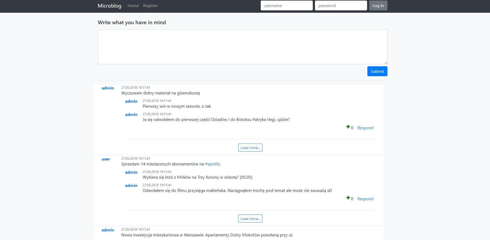
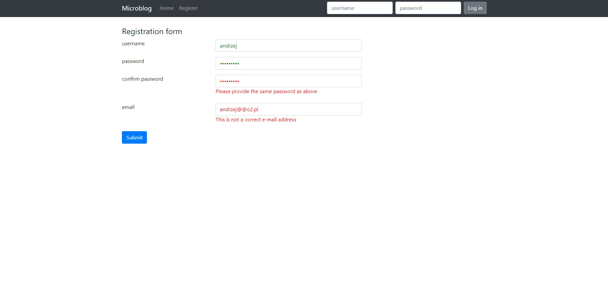

# microblog
Microblog is an application by developing which I intended to improve my programming skills.

## What's inside 
This project is based on Spring Boot and uses:
* Maven
* Spring Security
* Spring Data (Hibernate & MySQL)
* jQuery
* Bootstrap 4.0

## Functionality
Basic microblog operations are implemented:
* register new user (all the entered data is validated, passwords are encrypted)
* create new entry (only for logged-in users)
* comment an entry (logged-in)
* upvote an entry (only once per user per entry)
* there are tags with regex like #this (they get created automatically once used in an entry)
* view all entries in tag
* view other users profiles
* upload avatar to your own account
* entries are paginated

## Installation 
The project is created with Maven, so all you need to do is to import it to your IDE and build the Maven project.

## Database configuration 
Create a MySQL database called `microblog` and add your credentials to `/resources/application.properties`.  
The default ones are :

```
spring.datasource.url=jdbc:mysql://localhost:3306/microblog
spring.datasource.username=user
spring.datasource.password=password
```

## Usage 
Run the project and head out to [http://localhost:8080](http://localhost:8080)

## Preview
<br><br>

<br><br>

